## Python (`Processing.py` and `pygame`)

|        |     |     |
|---------------------------------|------------------------------|---------------------------|
| 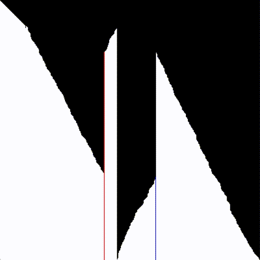 A visualization of different sorting algorithms. Pictured is in-place merge sort. [Code](processing/sorting.pyde)| 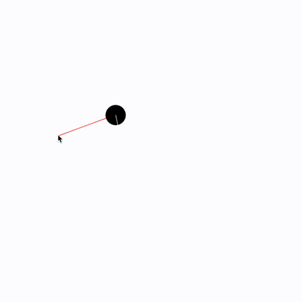 A simulation of a ball on a frictionless surface with rotation using moments. [Code](processing/rotate.pyde)| 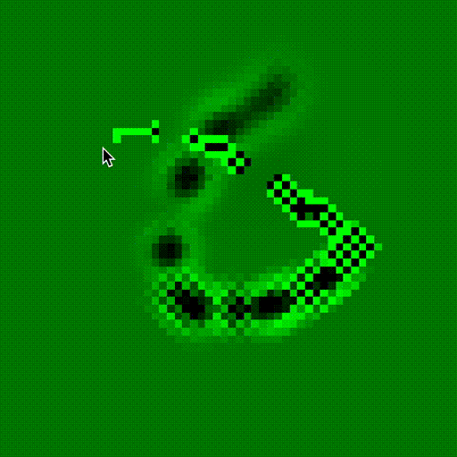 Fluid simulation using diffusion and advection for a pressure field. [Code](processing/fluid.pyde)|
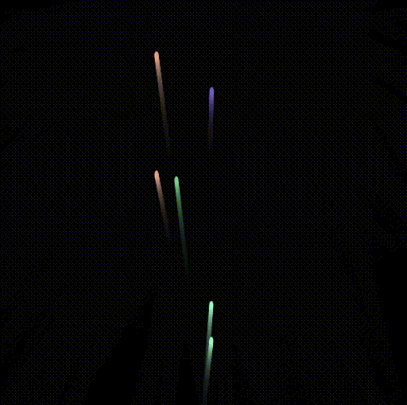 Fireworks that synchronize to the beat of a song. [Code](processing/fireworks.pyde) |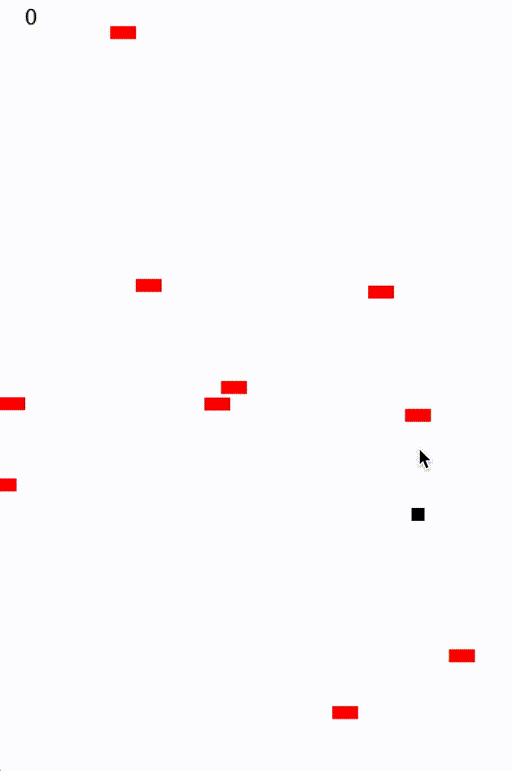 A game in the style of Doodlejump and Winterbells. [Code](processing/bells.pyde)| 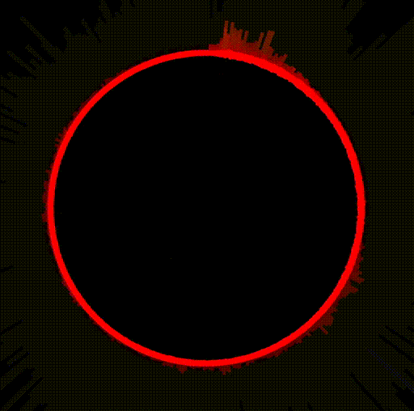 A spectrograph of live microphone input. [Code](processing/fft.pyde)
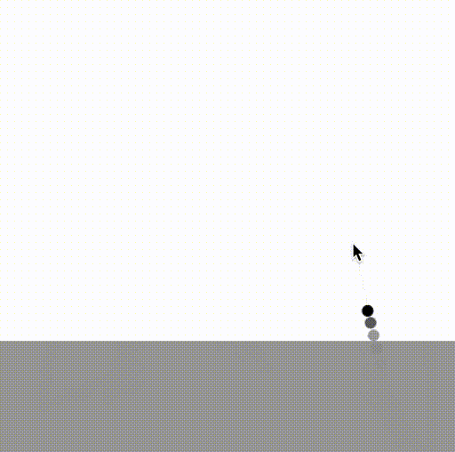 Simulating drag of a ball in a fluid. [Code](processing/water.pyde) | 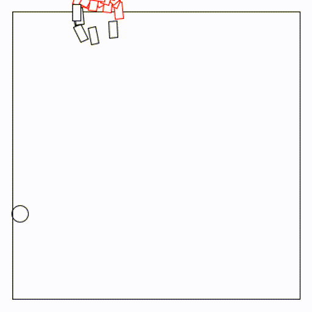 A classical boids simulation with extra constraints. [Code](processing/boids.pyde)| 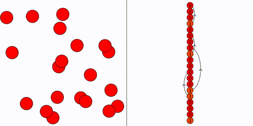 Showing the dependencies in the drawing order for many objects. [Code](processing/egraph.pyde)
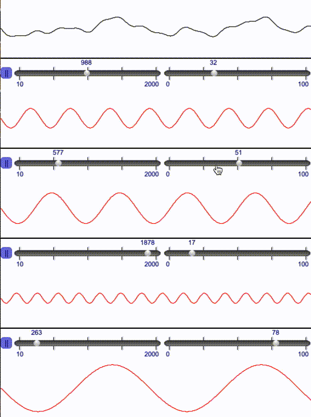 An app to explore the superposition of waves with sound output. [Code](processing/waves/physics_wave_app.pde) (Java)| 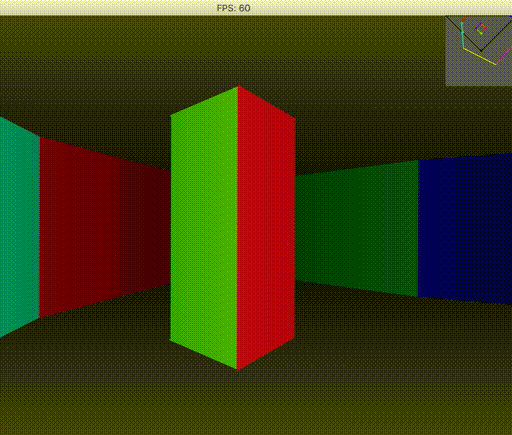 Software rendering 3D environments from 2D maps. [Code](processing/3d.pyde) |  A prototype line puzzle game. [Code](processing/puzzle.pyde)
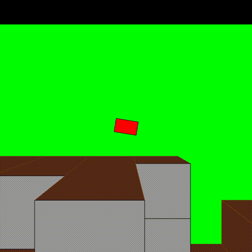 A prototype top-down open world driving game. [Code](processing/drive.pyde) | 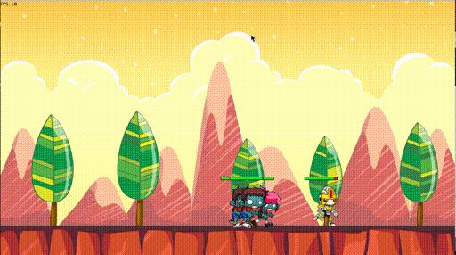 A simple infinite shooter and platformer. [Code](python/epqat) (`pygame`) | 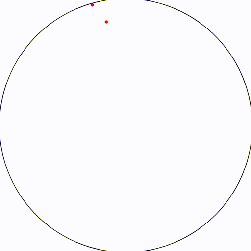 An illustration of the Poisson disc sampling method. [Code](processing/poisson.pyde)

## Python (Other)

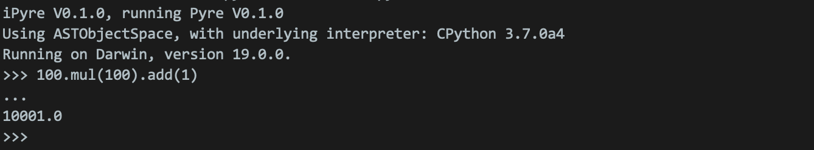

Pyre, a interpreted expression-oriented language with Python interoperability. [Code](https://github.com/tuomas56/pyre)

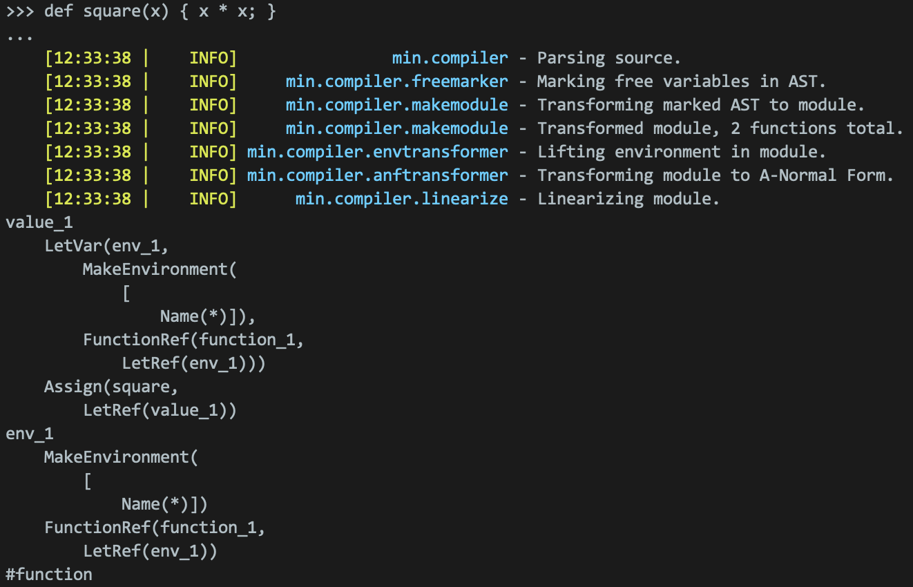

Min, a prototype compiler for a systems language. [Code](python/min)

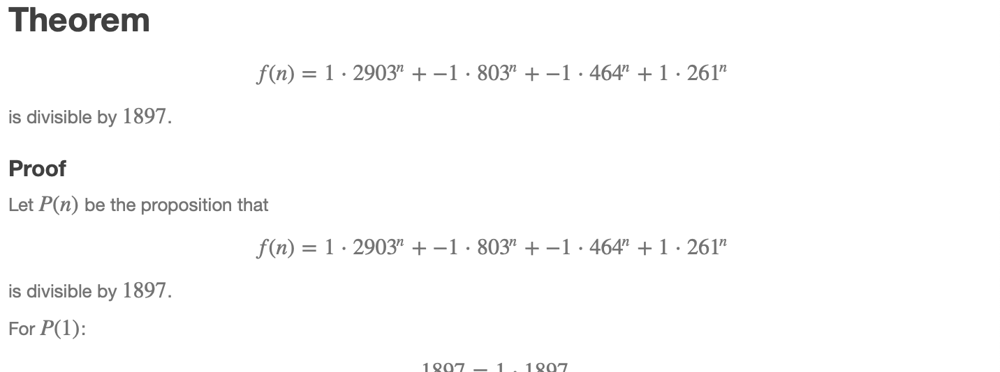

A program to automatically produce proofs for a class of exponential identities. [Code](python/exponentials)

## Haskell

AME, a computer algebra system designed for A-level students with a natural language input. [Code](haskell/ame)

An interpreter for an dynamically typed functional language with similar syntax to Haskell. [Code](haskell/hask)

## Rust

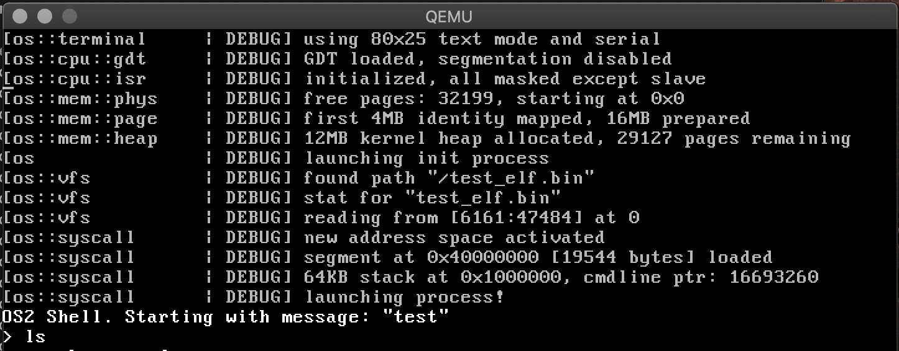

A hobby OS project for 32-bit x86. Currently capable of running simple ELF files. Has VGA Text Mode and serial output, and keyboard drivers. [Code](rust/os2r)

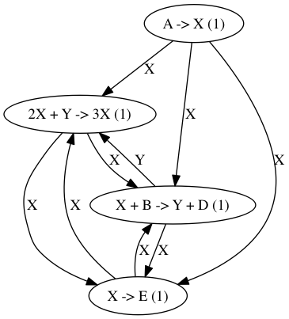

A program that runs chemical simulations using Gillespie's direct method, accelerated using LLVM. [Code](rust/m1r)

|     |      |      |
|-----|------|------|
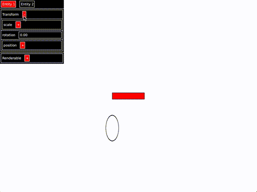|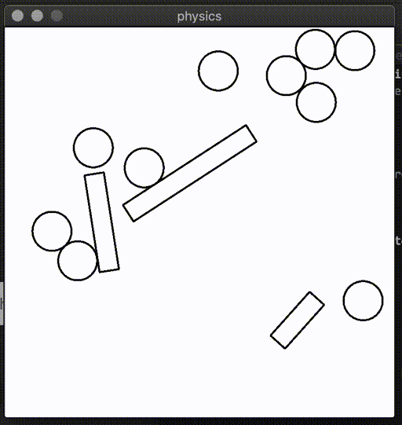|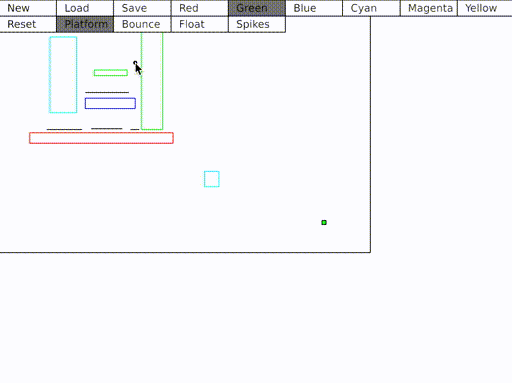

A port of Processing to Rust, and a prototype editor with physics support. Uses ECS architecture and a custom GUI library. The physics system uses a quadtree for efficient collisions. Code: [Engine](rust/pixelengine), [Editor](rust/geditor), [Physics](rust/physics), [Sample Game](rust/platformer)

A parallel raytracer supporting environment maps, shadows, emissive objects and diffuse, glossy and reflective materials. [Code](rust/raytracer)

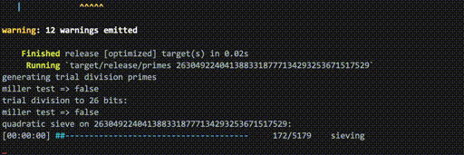

An implementation of the quadratic sieve algorithm for integer factorization. Has been used to successfully factor 60-digit integers. [Code](rust/primes)

## JavaScript

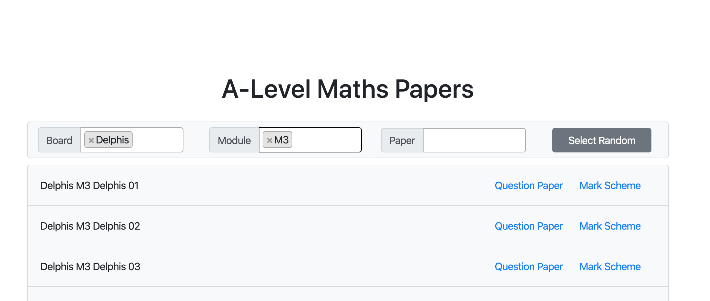

A search engine for A-level maths papers to help with revision. Live [here](http://tuomas56.github.io). [Code](js/papers)

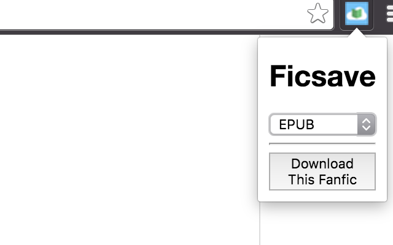

A Chrome extension to download ebooks automatically from AO3 and FFN via Ficsave. [Code](js/ficsave-chrome)

## Other

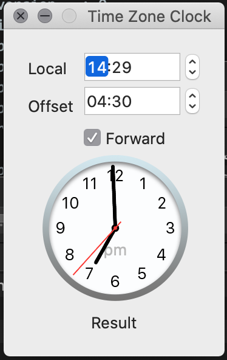

A simple mac application to convert time zones graphically. [Code](swift/Time\ Zone\ Clock)
